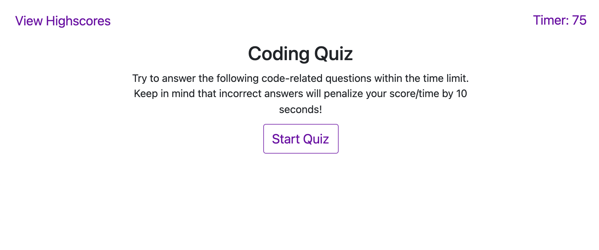
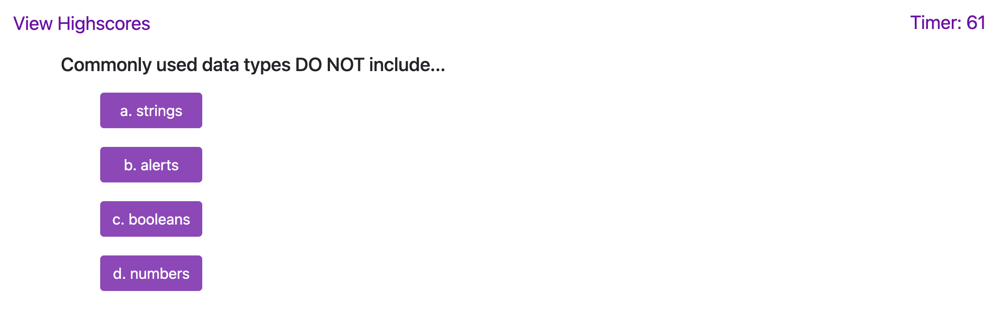
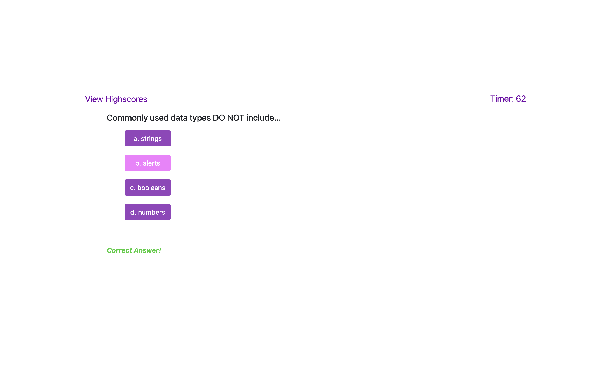
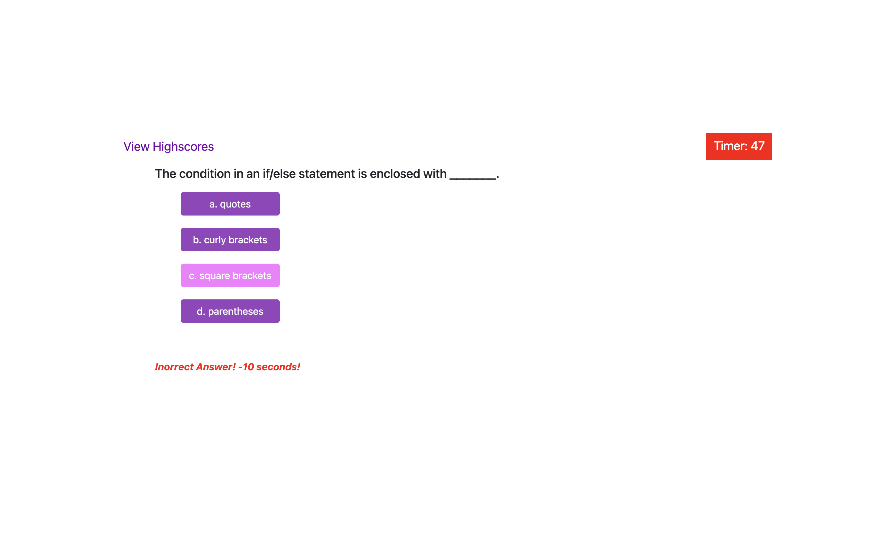
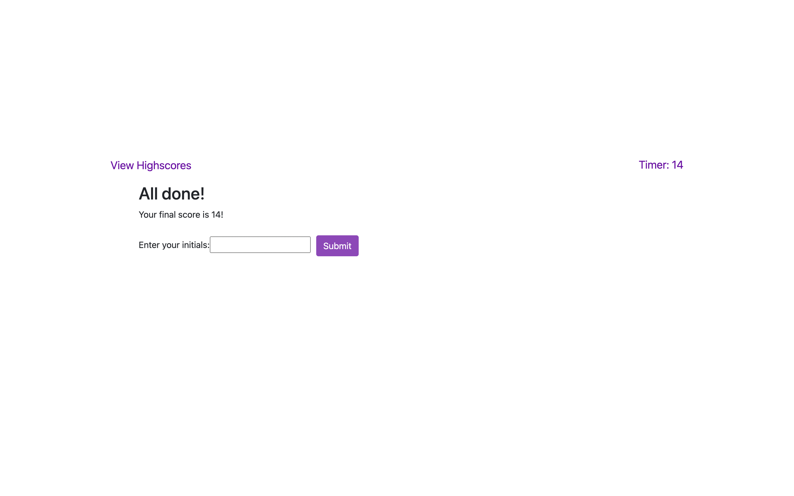
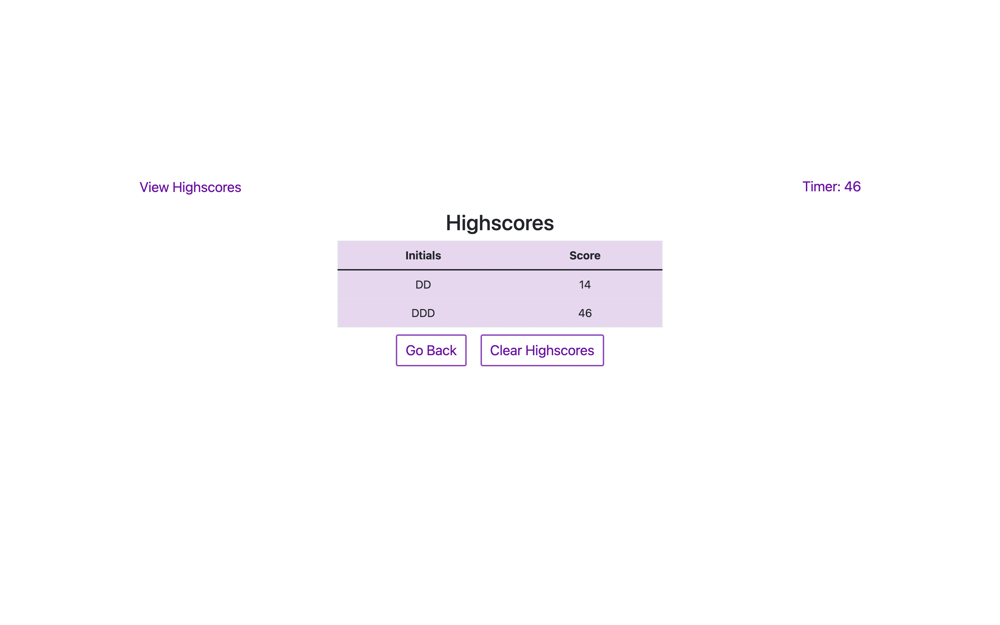

# Code Quiz

## Description

This code quiz is a fun way to test oyur knowledge of JavaScript while trying to beat a timer and earn a high score! After starting the quiz, you have 75 seconds to answer 5 questions. Incorrect answes will subtract 10 seconds from your time. After completing all the questions or running out of time, the amount of seconds left on the timer os your score! Scores are stored in Local Storage and displayed after completing the quiz, so you can look back at how you have done in the past and play again to try and beat your score! 

[Link to the webpage of the deployed application](https://danidelia253.github.io/code-quiz/)

[Project Repository](https://github.com/DaniDelia253/code-quiz)

---

## Table of Contents

If your README is very long, add a table of contents to make it easy for users to find what they need, such as the following:

* [Usage](#usage)
* [Credits](#credits)

---

## Usage

Here is what the application looks like on page load:

* **Start Quiz Button** starts the timer and shows the first question.
    

* When a **correct answer** is submitted, the next question is shown and a green indicator shows on the bottom of the page for 2 seconds.
    

* When an **incorrect answer** is submitted, the next question is shown and a red indicator shows on the bottom of the page for 2 seconds. Additionally, 10 seconds is deducted from the time and the timer flashes red for 2 seconds.
    

* When the  timer reaches 0 or all the questions are answered, the quiz is over and the Score Form page loads to show the user their score and ask fro an input of user's initials to save score.
    

* High scores are saved in local storage and displayed on the High Score Page.
    

---

## Credits

User Story and Mock Up provided by Trinity Education Sercice © 2021 Trilogy Education Services, LLC, a 2U, Inc. brand. Confidential and Proprietary. All Rights Reserved.

[Project Repository](https://github.com/DaniDelia253/code-quiz)

---